# Machine Learning Engineer Nanodegree
## Capstone Project
Kin Cheung  
May 14th, 2020

## I. Definition

### Project Overview

At the end of project, we will have a dog breed classification application that can identify if a given image is an image of a dog, a human or neither. Furthermore, if a dog is identified in the image, it will further classify the dog breed. On the other hand, if the given image is identified as an image of a human, it will go one step further to identify the resembling dog breed of the human. This application is intended for entertainment only and does not serve other purposes other than let the users have a laugh and have a good time with a few friends.

Along the way, we will explore some of state-of-the-art Convolutional Neural Networks (CNN) models for this kind of classification problems. We will see how incredibly powerful these models have become over the recent years and how well they have been built and designed for exactly what they are used for.

Although, these state-of-end-art models are very powerful, some of them could even beat average human eyes on classifications and we could just simply use them as they are our dog breed classification purpose. In order to more closely experience the challenges in this problem domain, we will try to build a vanilla CNN model from scratch and try to understand the difficulties involved in building such data processing pipelines that were intended to beat humans.

### Problem Statement

Image classification/recognition has been a very popular and challenging research area for many years. There are countless  ongoing researches in this area of computer vision in AI. There are also competitions every year for researchers to showcase their latest findings that they each have put countless of hours and mountain moving computing power into achieving.

Although, computers have become a lot more powerful over the past decades, and that is how some of the state-of-the-art models have come to life, this problem domain is still full of challenages and require a lot of our attentions. Nevertheless, image classifications and recongitions have many useful applications and have been helping us as humans in many areas that some of them can even save lives.

Dog breed classification is a small area of the whole image recognition domain. Although, our end application is not going to be a very helpful application in any means and might even kill a few brain cells of the users while laughing too hard, the obstacles and problems that we are trying to solve here are very relevant and can apply to many similar image classification tasks as well.

Classifying dog breeds is not as easy as it sounds, even to human eyes. Even if a human has come to learn all of the dog breeds, some of the dog breeds just look too similar, and some dog breeds even come with different colors and sizes. Sometimes for a human to correctly identify them, they will even need to hear them, watch their movements and physically touch them.

Labrador retrievers in 3 different color variations:
black| brown | yellow
------------ | ------------- | -------------
 |  | 

So for a computer to be able to correctly classifying dog breeds, it is an incredibly difficult task. Although, computers can recognise patterns and colors relatively easily, classifying dog breeds is clearly on another difficulty level.

As mentioned earlier, there are some existing CNN models that have already performed very well in this problem domain, but we also want to see why just any of us can come up with another model that out-perform the rest. What are the constraints? What have made this problem so much harder?

First, we will try to build a simple CNN with considerations of computer memory, disk space and time constraints that we have in our hands and see if we can come up with a dog breed classifier that can classify any dog breed at all. Next, we will borrow one of the best state-of-the-art CNN models, ResNet to see how well it performs compared to your own vanilla CNN model. 

### Metrics

The evaluation metric that I will use is a log loss metric, precisely a cross entropy loss function. I will use that in the vanilla CNN model that I am going to build. Since the task that we have here is a classification task, that means I am going to use activation functions to model probabilities in the output layer of the CNN. In addition, cross entropy is an ideal option for handling class imbalances as it is exactly the case here with our training datasets that we will look at in the next section when we discuss data exploration and my findings.

## II. Analysis

### Data Exploration & Exploratory Visualization

The datasets that I am going to use are provided by Udacity, and they can be downloaded here https://s3-us-west-1.amazonaws.com/udacity-aind/dog-project/dogImages.zip. They are in RGB JPEG format separated into different folders by dog breeds and further divided into training, validation and test sets. Arbitrary images will also be used at the end of the project to test out the final application. The images will include dogs, humans and neither of both.

From the graph below, we can see that the images provided are in different sizes. The green and blue line represent width and height of the images in the datasets, respectively. 

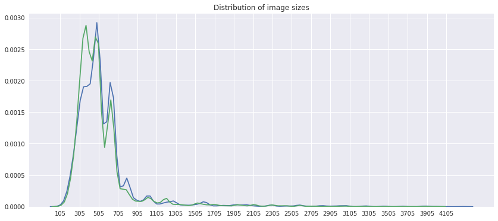

Also we can see that majority of the images are between 320 and 480 H x W pixels. In order to feed the images to our models as inputs, we need to resize them uniformly and since the dimensions of the images basically represent features, we need to choose a size that could maintain reasonably good performance and not consume too much memory and computer resources. Thus, I will resize the images to relatively smaller sizes around 32x32 to 56x56 which are around 1/10 of the original sizes so that the training process will not be too overwhelming.

I also randomly selected a few images to see what they actually looked like. I came to realise that the subjects that we are interested in each image are positioned differently and so are the compositions. Because of these characteristics, having fixed cropping positions did not seem to be a good idea and I decided to go with random cropping, which could possibly land better positioned images on average.

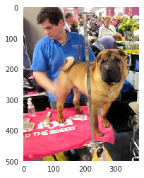
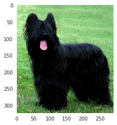
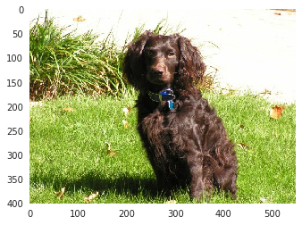
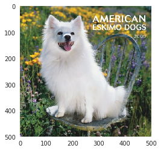
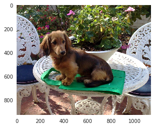

In order to make the most out of the given training dataset, when I import the training dataset, I will perform the following transformations to the images so that I can produce more variations out of them.

A crop of random size (default: of 0.08 to 1.0) of the original size and a random aspect ratio (default: of 3/4 to 4/3) of the original aspect ratio is made. This crop is finally resized to given size.

 - A crop of random size of 0.08 to 1.0 of the original size
 - A random aspect ratio of 3/4 to 4/3 of the original aspect ratio
 - Crop to a fixed size of 56x56 pixels
 - Horizontally flip randomly with a 0.5 probability
 
From the chart below, it also shows us that there are 133 classes in total and different number of images contained for each class. In addition, since the classes in the dataset are slightly imbalanced, I will make use of a weighted random sampler in PyTorch to sample the training data in random with weights that are calculated for each available class in the pre-processing stage. The purpose of this pre-processing is to slightly balance out the class imbalances. The class distributions after the pre-processing will look like this. 

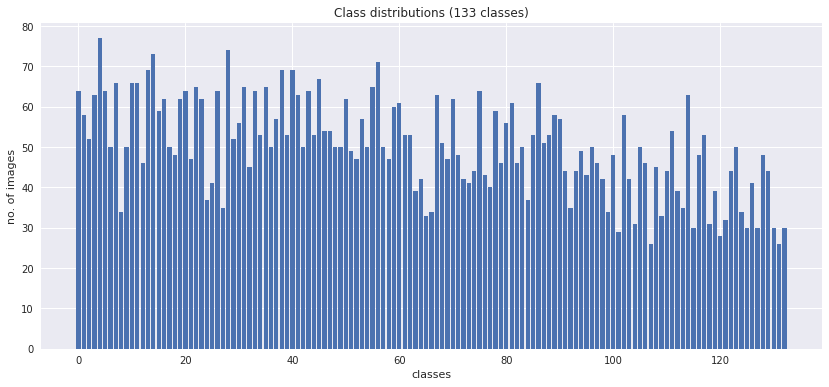

### Algorithms and Techniques

I will be using cross entropy loss function as the loss function in building the vanilla CNN from scratch. Since what we have in hand is a typical classification task that we are using activation functions to model probabilities in the outer layer of the CNN. Futhermore, our training dataset has slight class imbalances, although, we will also make use of a random weighted sampler to smooth out the imbalances, cross entropy is still a very solid choice in this case.

As for the gradient descent function, I will be using stochastic gradient descent (SGD) with momentum factor of 0.9. Momentum factor has an important role in deep learning such as in a CNN as stated here. http://www.cs.toronto.edu/%7Ehinton/absps/momentum.pdf.

In term of the CNN architecture, it will be covered in detail in the implementation section.

### Benchmark

A simple CNN was built from scratch as a benchmark. This simple CNN model was trained using the training dataset provided after some data preprocessing and validated against a dedicated set of validation data.

This simple CNN was trained a relatively smaller feature set which was 56x56 pixel images as inputs with 3 channels of RGB. The architecture consisted of 4 CONV-ReLU-POOL layers to provide reasonably good performance and did not take too much computer memory and time to train.

## III. Methodology

### Data Preprocessing

With image transformation pipeline chosen, here we can see a random batch in the training set actually looks like. A batch contains 4 images which have been pre-processed using the transformation pipeline described in the previous section. Each of the pre-processed image is now in a size of 56x56 pixels.
 
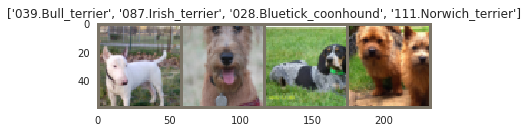

After applying a randomized weighted sampler to the image loader with a ramdomised transformation pipeline, we have come to a more balanced class distributions as shown below.

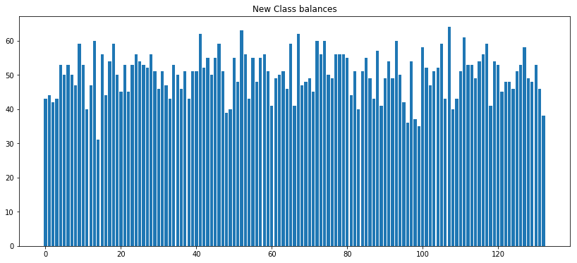

### Implementation

After I had tried a number of CNN architectures with unsatisfactory results, I finally settled with an architecture that could satisfy the computer memory and GPU memory constraints as well as time constraints that had.

The final CNN architecture is illustrated here 
`INPUT -> (CONV -> ReLU -> POOL) * 4 -> (FC -> ReLU -> Dropout) * 2 -> FC`

1. The input was a 56x56x3 (WxHxC) feature map. I chose this size because it was small enough to train quickly and fit in the GPU memory available. At the same time, the feature set was big enough to maintain the level of details of the original features.
2. The input layer was immediately followed by four layers of CONV layer to allow the model to learn in greater details since dog breeds do differ in some very subtle ways. For each CONV layer, as I had learned from VGG's implementation, I deicded to go with a kernel size of 3, a stride size of 1 to keep every detail in the feature map and a zero padding of 1 to avoid details around the boundaries being washed out. I began with a receptive field of size 32, 64, 128 and ended with 256 to keep the memory footprint as small as possible and at the same time keep up with the depth of learning.
3. I added a RELU activation layer after each CONV layer to speed up the training time
4. A RELU layer was then followed by a POOL layer of kernel size 2 and stride of 2 to reduce feature map sizes and at the same time maintained the performance as doing so.
5. After 4 CONV-ReLU-POOL cycles, 2 consecutive fully connected layers were used to reduce the dimensions from (256 x 7 x 7) nodes to 4096. A dropout layer after each FC layer was added to reduce overfitting. The whole network was concluded with a final output layer of 133 nodes as defined as the number of classes in the training dataset.
6. In addition, an adaptive average pool was added after the CONV-ReLU-POOL loops to reduce overlapping in pooling.

### Refinement

Deciding on the CNN architecture and parameters as well as the size of the input feature map appeared to be quite a challenge in terms of the computer resources and time constraints. I started with an image size of 32x32 of a batch size of 4 to begin with. I had a very shallow network with only 1-2 CONV-ReLU-POOL layers. 

At some points, the learning rate was set too high, 0.05. As a result, the training loss and the validation loss were not decreasing. After it had been changed to 0.001, the training loss and the validation loss started to show positive signs and were decreasing after each epoch as expected. However, the initial models performed very pooly with the test loss being very high. Even increasing the number of epochs did not seem to be able improve the performance at all and it started to show some sign of overfitting as the validation loss and test loss were very extreme. 

After the initial unsatisfactory results, I started to try out different parameter combinations that include the input image size, the batch size, the kernel size, the stride size, the zero-padding size, the number of CONV layers with/without pooling layers, the sizes of the FC layers, the learning rate as well as the number of epochs.

At one point, I thought the input image sizes were too small, but after I had tried to increase the image size to 112x122 and even 244x244, the model performance did not improve at all and the training time had become too lengthy. As the image size increased, so did the memory usage, the process started to cause out of memory errors, and then I decided to change the focus on the architecture of the CNN.

At the beginning, I thought that having a deep network could be an overkill. However, as it turned out a too shallow network just could not make the cuts at all either. As dog breed classification as stated in the problem statement is a complicated matter, I needed a deep enough network for a model to have enough features to learn from.

## IV. Results

### Model Evaluation and Validation

The final version of the CNN architecture was a network with 4-CONV layers followed by 3-FC layers as described in detail in the implementation section.

The final evaluation process was carried out using a dedicated test set that was separated from the rest of the training and validation dataset from the beginning. Each image in the test data was properly labeled and the predicted results from our model were compared against the truth labels.

A final percentage in accuracy after all images in the test set were tested against. We did not aim to beat any of the state-of-the-art CNN models, but we wanted to have a model that can at least be able to predict 10% of the test data correctly. Since we had 133 classes with 836 images in the test set in total, a random guess could only result in a less than 1% accuracy.

As we can see from this test run, we were able to predict 88 out of the total test images correctly. That was slightly more than 10%.

> Training Loss: 4.057460 	Validation Loss: 3.781314
>
> Test Loss: 3.947899
> 
> Test Accuracy: 10% (88/836)

### Justification

The final CNN dog breed classifier solution was built using transfer learning and I chose to use a pre-trained model from ResNet. The architecture of the CNN was a simple fully-connected layer with 133 nodes to denote as many classes after the trained features from ResNet. The training dataset, the validation dataset and the test dataest were identical to the datasets that were used for the vanilla CNN model as the benchmark.

As it turned out, the CNN model trained using transfer learning of a pre-trained model from ResNet easily out-performed the benchmark vanilla model after being trained for 10 epochs. Here is a batch of randomly selected training images.

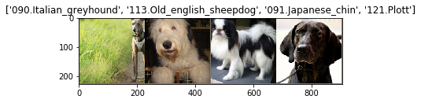

The test result was very impressive. It was able to correctly classify over 80% of the dog breeds in the test set.

> Test Loss: 0.746416
> 
> Test Accuracy: 81% (683/836)

## V. Conclusion

### Free-Form Visualization

At the beginning of this project, we promised an application of a dog breed classifier that can tell us if a given image is an image of a dog or a human. Here are the results from our not-so-useful dog creed classifier application.

The comments above the images are the results of the classifier application.
 - When a dog is identified, it will say 'hello doggy, you are a ' followed by the classified dog breed name
 - When a human is identified, it will say 'are you a human or a ' following by the resembling dog breed to the human
 - When neither is identified, it will say 'what are you?'

|what are you?|are you a human or a Pharaoh hound?|what are you?|
|-|-|-|
|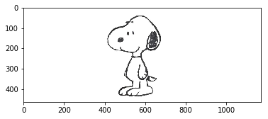|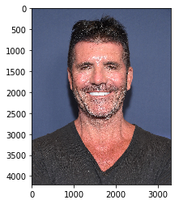|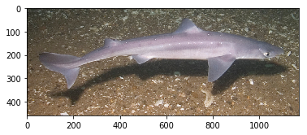|

|hello doggy, you are a  Neapolitan mastiff|hello doggy, you are a  American eskimo dog|are you a human or a Dogue de bordeaux?|
|-|-|-|
|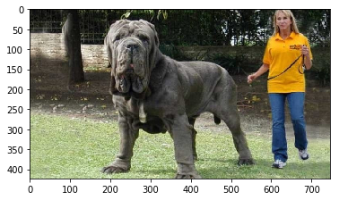|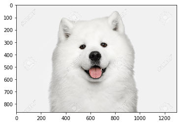|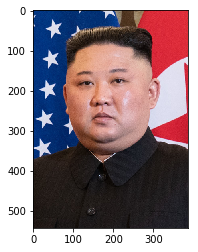|

### Reflection

As we can here see from our human eyes, classifying dog breeds is not an easy task by any means. Even though, we have the technologies, such as CNN, to train models that can classify dog breeds very well, but being able to train such powerful models takes tremendous amount of man-brain hours, computer-brain power and time.

In the vanilla CNN model that we used as the benchmark was itself already a reasonably sophisticated piece of technology and so much technology was involved, it was only able to classify slightly over 10% of the test images correctly. Can we image how much that went into preparing and training one of the state-of-the-art CNN models, like ResNet and VGG net? That is just mind-blowing.

### Improvement

The final solution of the dog breed classifier was much better than I had expected. It did not expect that image recognition has gone this far and there are models out there can be used to classify such difficult tasks such as dog breeds. As I have heard Professor Andrew Ng said it in his famous ML course that the most challenging part of machine learning is to have the resources to get a good volumn of training data with labels and the future endless computing power to train models. 

There are just a lot for me to discover to give any improvement over I have done so far. I did not know anything about CNN before this project and came to this project with almost a completely blank sheet. I have done literally everything that I could do at this stage to make it run with the memory and time constraints and have it performed reasonably well within expectations.

I could still think of some possible improvements that I know of in term of my current knowledge.

1. Better ways to handle data imbalancing in training datasets. I wanted to know if they are other ways. Is using log loss the ultimate solution?
2. Better ways to augment training datasets so that I could get better variations and make the best use of training datasets in hand.
3. Stack more CONV layers before pooling in the first layer to get better learning results I guess.
