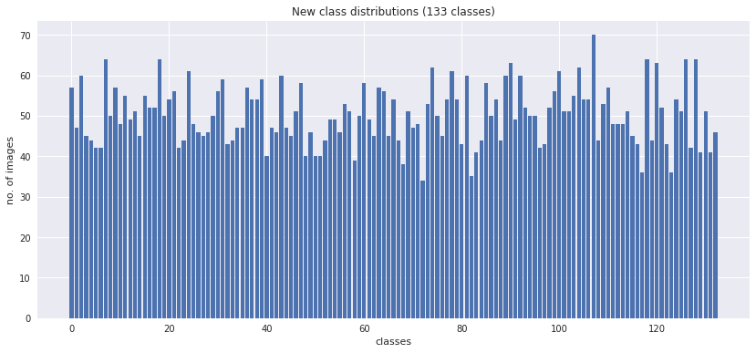

# Machine Learning Engineer Nanodegree
## Capstone Project
Kin Cheung  
May 14th, 2020

## I. Definition

### Project Overview

At the end of project, we will have a dog breed classification application that can identify if a given image is an image of a dog, a human or neither. Furthermore, if a dog is identified in the image, it will further classify the dog breed. On the other hand, if the given image is identified as an image of a human, it will go one step further to identify the resembling dog breed of the human. This application is intended for entertainment only and does not serve other purposes other than let the users have a laugh and have a good time with a few friends.

Along the way, we will explore some of state-of-the-art Convolutional Neural Networks (CNN) models for this kind of classification problems. We will see how incredibly powerful these models have become over the recent years and how well they have been built and designed for exactly what they are used for.

Although, these state-of-end-art models are very powerful, some of them could even beat average human eyes on classifications and we could just simply use them as they are our dog breed classification purpose. In order to more closely experience the challenges in this problem domain, we will try to build a vanilla CNN model from scatch and try to understand the difficulties involved in building such data processing pipelines that were intended to beat humans.

### Problem Statement
In this section, you will want to clearly define the problem that you are trying to solve, including the strategy (outline of tasks) you will use to achieve the desired solution. You should also thoroughly discuss what the intended solution will be for this problem. Questions to ask yourself when writing this section:
- _Is the problem statement clearly defined? Will the reader understand what you are expecting to solve?_
- _Have you thoroughly discussed how you will attempt to solve the problem?_
- _Is an anticipated solution clearly defined? Will the reader understand what results you are looking for?_

Image classification/recognition has been a very popular and challenging rsearch area for many years. There are countless  ongoing researches in this area of computer vision in AI. There are also competitions every year for researchers to showcase their latest findings that they each have put countless of hours and mountain moving computing power into achieving.

Although, computers have become a lot more powerful over the past decades, and that is how some of the state-of-the-art models have come to life, this problem domain is still full of challenages and require a lot of our attentions. Nevertheless, image classifications and recognitions have many useful applications and have been helping us as humans in many areas that some of them can even save lives.

Dog breed classification is a small area of the whole image recognition domain. Although, our end application is not going to be a very helpful application in any means and might even kill a few brain cells of the users while laughing too hard, the obstacles and problems that we are trying to solve here are very relevant and can apply to many similar image classification tasks as well.

Classifying dog breeds is not as easy as it sounds, even to human eyes. Even if a human has come to learn all of the dog breeds, some of the dog breeds just look too similar, and some dog breeds even come with different colors and sizes. Sometimes for a human to correctly identify them, they will even need to hear them, watch their movements and phyiscally touch them.

Labrador retrievers in 3 different color variations:
black| brown | yellow
------------ | ------------- | -------------
 |  | 

So for a computer to be able to correctly classifying dog breeds, it is an incredibly difficult task. Although, computers can recognise patterns and colors relatively easily, classifying dog breeds is clearly on another difficulty level.

As mentioned earlier, there are some existing CNN models that have already performed very well in this problem domain, but we also want to see why just any of us can come up with another model that out-perform the rest. What are the contraints? What have made this problem so much harder?

First, we will try to build a simple CNN with considerations of computer memory, disk space and time contraints that we have in our hands and see if we can come up with a dog breed classifier that can classify any dog breed at all. Next, we will borrow one of the best state-of-the-art CNN models, ResNet to see how well it perform compared to your own vanilla CNN model. 

### Metrics
In this section, you will need to clearly define the metrics or calculations you will use to measure performance of a model or result in your project. These calculations and metrics should be justified based on the characteristics of the problem and problem domain. Questions to ask yourself when writing this section:
- _Are the metrics you’ve chosen to measure the performance of your models clearly discussed and defined?_
- _Have you provided reasonable justification for the metrics chosen based on the problem and solution?_

The evaluation metric that I will use is a log loss metric, precisely a cross entropy loss function. I will use that in the vanilla CNN model that I am going to build. Since the task that we have here is a classification task, that means I am going to use activation functions to model probabilities in the output layer of the CNN. In addition, cross entropy is an ideal option for handling class imbalances as it is exactly the case here with our training dataests that we will look at in the next section when we discuss about data exploration and my findings.

## II. Analysis
_(approx. 2-4 pages)_

### Data Exploration
In this section, you will be expected to analyze the data you are using for the problem. This data can either be in the form of a dataset (or datasets), input data (or input files), or even an environment. The type of data should be thoroughly described and, if possible, have basic statistics and information presented (such as discussion of input features or defining characteristics about the input or environment). Any abnormalities or interesting qualities about the data that may need to be addressed have been identified (such as features that need to be transformed or the possibility of outliers). Questions to ask yourself when writing this section:
- _If a dataset is present for this problem, have you thoroughly discussed certain features about the dataset? Has a data sample been provided to the reader?_
- _If a dataset is present for this problem, are statistics about the dataset calculated and reported? Have any relevant results from this calculation been discussed?_
- _If a dataset is **not** present for this problem, has discussion been made about the input space or input data for your problem?_
- _Are there any abnormalities or characteristics about the input space or dataset that need to be addressed? (categorical variables, missing values, outliers, etc.)_

The datasets that I am going to use are provided by Udacity and they can be downloaded here https://s3-us-west-1.amazonaws.com/udacity-aind/dog-project/dogImages.zip. They are in RGB JPEG format separated into different folders by dog breeds and further divided into training, validation and test sets. Arbitrary images will also be used at the end of the project to test out the final application. The images will include dogs, humans and neither of both.

From the graph below, we can see that the images provided are in different sizes. The green and blue line represent width and height of the images in the datasets, respectively. 

Also we can see that majority of the images are between 320 to 480 H x W pixels. In order to feed the images to our models as inputs, we need to resize them uniformly and since the dimensions of the images basically represent features, we need to choose a size that could maintain reasonably good performance and not consume too much memory and computer resources. Thus, I will resize the images to relatively smaller sizes around 32x32 to 56x56 which are around 1/10 of the original sizes so that the training process will not be too overwhelming.

I also randomly selected a few images to see what they actually looked like. I came to realise that the subjects that we are interested in each image are positioned differently and so are the compostions. Because of these characteristics, having fixed cropping positions did not seem to be a good idea and I deicded to go with random cropping, which could possibly land better positioned images on average.

In order to make the most out of the given training dataset, when I import the training dataset, I will perform the following transformations to the images so that I can produce more variations out of them.

A crop of random size (default: of 0.08 to 1.0) of the original size and a random aspect ratio (default: of 3/4 to 4/3) of the original aspect ratio is made. This crop is finally resized to given size.

 - A crop of random size of 0.08 to 1.0 of the original size
 - A random aspect ratio of 3/4 to 4/3 of the original aspect ratio
 - Crop to a fixed size of 56x56 pixels
 - Horizontally flip randomly with a 0.5 probability
 
From the chart below, it also shows us that there are 133 classes in total and different number of images contained for each class. In addition, since the classes in the dataset are slightly imbalanced, I will make use of a weighted random sampler in PyTorch to sample the training data in random with weights that are calculated for each available class in the pre-processing stage. The purpose of this pre-processing is to slightly balance out the class imbalances. The class dritribution after the pre-processing will look like this. 

### Exploratory Visualization
In this section, you will need to provide some form of visualization that summarizes or extracts a relevant characteristic or feature about the data. The visualization should adequately support the data being used. Discuss why this visualization was chosen and how it is relevant. Questions to ask yourself when writing this section:
- _Have you visualized a relevant characteristic or feature about the dataset or input data?_
- _Is the visualization thoroughly analyzed and discussed?_
- _If a plot is provided, are the axes, title, and datum clearly defined?_

### Algorithms and Techniques
In this section, you will need to discuss the algorithms and techniques you intend to use for solving the problem. You should justify the use of each one based on the characteristics of the problem and the problem domain. Questions to ask yourself when writing this section:
- _Are the algorithms you will use, including any default variables/parameters in the project clearly defined?_
- _Are the techniques to be used thoroughly discussed and justified?_
- _Is it made clear how the input data or datasets will be handled by the algorithms and techniques chosen?_

I will be using cross entropy loss function as the loss function in building the vanilla CNN from scratch. Since what we have in hand is a typical classification task that we are using activation functions to model probabilities in the outer layer of the CNN. Futhermore, our training dataset has slight class imbalances, although, we will also make use of a random weighted sampler to smooth out the imbalances, cross entropy is still a very solid choice in this case.

As for the graident descent function, I will be using stochastic gradient descent (SGD) with momentum factor of 0.9. Momentum factor has an important role in deep learning such as in a CNN as stated here. http://www.cs.toronto.edu/%7Ehinton/absps/momentum.pdf.

In term of the CNN architecture, it will be covered in detail in the implementation section.

### Benchmark
In this section, you will need to provide a clearly defined benchmark result or threshold for comparing across performances obtained by your solution. The reasoning behind the benchmark (in the case where it is not an established result) should be discussed. Questions to ask yourself when writing this section:
- _Has some result or value been provided that acts as a benchmark for measuring performance?_
- _Is it clear how this result or value was obtained (whether by data or by hypothesis)?_

A simple CNN was built from scratch as a benchmark. This simple CNN model was trained using the training dataset provided after some data pre-processing and validated against a dedeicated set of validation data.

This simple CNN was trained a relatively smaller feature set which was 56x56 pixeled images as inputs with 3 channels of RGB. The architecture consisted of 4 CONV-ReLU-POOL layers to provide reasonably good performance and did not take too much computer memory and time to train.

## III. Methodology
_(approx. 3-5 pages)_

### Data Preprocessing
In this section, all of your preprocessing steps will need to be clearly documented, if any were necessary. From the previous section, any of the abnormalities or characteristics that you identified about the dataset will be addressed and corrected here. Questions to ask yourself when writing this section:
- _If the algorithms chosen require preprocessing steps like feature selection or feature transformations, have they been properly documented?_
- _Based on the **Data Exploration** section, if there were abnormalities or characteristics that needed to be addressed, have they been properly corrected?_
- _If no preprocessing is needed, has it been made clear why?_

With image transformation pipeline chosen, here we can see a random batch in the training set actually looks like. A batch contains 4 images which have been pre-processed using the transformation pipeline described in the previous section. Each of the pre-processed image is now in a size of 56x56 pixels.
 

After applying a random weighted sampler to the image loader with a ramdomised transformation pipeline, we have come to a more balanced class distributions as shown below.

### Implementation
In this section, the process for which metrics, algorithms, and techniques that you implemented for the given data will need to be clearly documented. It should be abundantly clear how the implementation was carried out, and discussion should be made regarding any complications that occurred during this process. Questions to ask yourself when writing this section:
- _Is it made clear how the algorithms and techniques were implemented with the given datasets or input data?_
- _Were there any complications with the original metrics or techniques that required changing prior to acquiring a solution?_
- _Was there any part of the coding process (e.g., writing complicated functions) that should be documented?_

After I had tried a number of CNN achitectures with unsatisfactory results, I finally setted with an achitecutre that could satisty the computer memory and GPU memory constraints as well as time constraints that had.

The final CNN architecture is illustrated here 
`INPUT -> (CONV -> ReLU -> POOL) * 4 -> (FC -> ReLU -> Dropout) * 2 -> FC`

1. The input was a 56x56x3 (WxHxC) feature map. I chose this size because it was small enough to train quickly and fit in the GPU memory available. At the same time, the feature set was big enough to maintain the level of details of the original features.
2. The input layer was immediately followed by four layers of CONV layer to allow the model to learn in greater details since dog breeds do differ in some very subtle ways. For each CONV layer, as I had learnt from VGG's implementation, I deicded to go with a kernel size of 3, a stride size of 1 to keep every detail in the feature map and a zero padding of 1 to avoid details around the boundaries being washed out. I began with a receptive field of size 32, 64, 128 and ended with 256 to keep the memory footprint as small as possible and at the same time keep up with the depth of learning.
3. I added a RELU activation layer after each CONV layer to speed up the training time
4. A RELU layer was then followed by a POOL layer of kernel size 2 and stride of 2 to reduce feature map size and at the same time maintened the performance as doing so.
5. After 4 CONV-ReLU-POOL cycles, 2 consecutive fully connected layers were used to reduce the dimensions from (256 x 7 x 7) nodes to 4096. A dropout layer after each FC layer was added to reduce overfitting. The whole network was concluded with a final output layer of 133 nodes as defined as the number of classes in the training dataset.
6. In addition, an adaptive average pool was added after the CONV-ReLU-POOL loops to reduce overlapping in pooling.

### Refinement
In this section, you will need to discuss the process of improvement you made upon the algorithms and techniques you used in your implementation. For example, adjusting parameters for certain models to acquire improved solutions would fall under the refinement category. Your initial and final solutions should be reported, as well as any significant intermediate results as necessary. Questions to ask yourself when writing this section:
- _Has an initial solution been found and clearly reported?_
- _Is the process of improvement clearly documented, such as what techniques were used?_
- _Are intermediate and final solutions clearly reported as the process is improved?_

Deciding on the CNN achitecture and parameters as well as the size of the input feature map appeared to be quite a challenge in terms of the computer resources and time constraints. I started with an image size of 32x32 of a batch size of 4 to begin with. I had a very shallow network with only 1-2 CONV-ReLU-POOL layers. 

At some points, the learning rate was set too high. At a result, the training loss and the validation loss were not descrasing. After it had been changed to 0.01, the training loss and the validation loss started to show positive signs and were decreasing after each epoch as expected. However, the initial models performed very pooly with the test loss being very high. Even increasing the number of epochs did not seem to be able improve the performance at all and it started to show some sign of overfitting as the validation loss and test loss were very extreme. 

After the initial unsatisfactory results, I started to try out different parameter combinations that include the input image size, the batch size, the kernal size, the stride size, the zero-padding size, the number of CONV layers with/without pooling layers, the sizes of the FC layers, the learning rate as well as the number of epochs.

At one point, I thought the input image sizes were too small, but after I had increased the image size to 112x122 and even 244x244, the model performance did not improve at all and the training time had become too lengthy. As the image size increased, so did the memory usage, the process started to cause out of memory errors, and then I decided to change the focus on the architecture of the CNN.

At the begnning, I thought that having a deep network could be an overkill. However, as it turned out a too shallow network just could not make the cuts at all either. As dog breed classification as stated in the problem statement is a complicated matter, I needed a deep enough network for a model to have enough features to learn from.

## IV. Results
_(approx. 2-3 pages)_

### Model Evaluation and Validation
In this section, the final model and any supporting qualities should be evaluated in detail. It should be clear how the final model was derived and why this model was chosen. In addition, some type of analysis should be used to validate the robustness of this model and its solution, such as manipulating the input data or environment to see how the model’s solution is affected (this is called sensitivity analysis). Questions to ask yourself when writing this section:
- _Is the final model reasonable and aligning with solution expectations? Are the final parameters of the model appropriate?_
- _Has the final model been tested with various inputs to evaluate whether the model generalizes well to unseen data?_
- _Is the model robust enough for the problem? Do small perturbations (changes) in training data or the input space greatly affect the results?_
- _Can results found from the model be trusted?_

The final version of the CNN architecture was a network with 4-CONV layers followed by 3-FC layers as described in detail in the implementation section.

The final evaluation process was carried out using a dedicated test set that was separated from the rest of the training and validation dataset from the beginning. Each image in the test data was properly labeled and the predicted results from our model were compared against the truth labels.

A final percentage in accuracy after all images in the test set were tested against. We did not aim to beat any of the state-of-the-art CNN models, but we wanted to have a model that can at least be able to predict 10% of the test data correctly. Since we had 133 classes with 836 images in the test set in total, a random guess could only result in a less than 1% accuracy.

As we can see from this test run, we were able to predict 88 out of the total test images correctly. That was slightly more than 10%.

> Training Loss: 4.057460 	Validation Loss: 3.781314
>
> Test Loss: 3.947899
> 
> Test Accuracy: 10% (88/836)

### Justification
In this section, your model’s final solution and its results should be compared to the benchmark you established earlier in the project using some type of statistical analysis. You should also justify whether these results and the solution are significant enough to have solved the problem posed in the project. Questions to ask yourself when writing this section:
- _Are the final results found stronger than the benchmark result reported earlier?_
- _Have you thoroughly analyzed and discussed the final solution?_
- _Is the final solution significant enough to have solved the problem?_

The final CNN dog breed classifier solution was built using transfer learning and I chose to use a pretrained model from ResNet. The architecture of the CNN was a simple fully-connected layer with 133 nodes to denote as many classes after the trained features from ResNet. The training dataset, the validation dataset and the test dataest were identical to the datasets that were used for the vanilla CNN model as the benchmark.

As it turned out, the CNN model trained using transfer learning of a pretrained model from ResNet easily out-performed the benchmark vanilla model after being trained for 10 epochs. Here is a batch of randomly selected training images.

The test result was very impressive. It was able to correctly classify over 80% of the dog breeds in the test set.

> Test Loss: 0.746416
> 
> Test Accuracy: 81% (683/836)

## V. Conclusion
_(approx. 1-2 pages)_

### Free-Form Visualization
In this section, you will need to provide some form of visualization that emphasizes an important quality about the project. It is much more free-form, but should reasonably support a significant result or characteristic about the problem that you want to discuss. Questions to ask yourself when writing this section:
- _Have you visualized a relevant or important quality about the problem, dataset, input data, or results?_
- _Is the visualization thoroughly analyzed and discussed?_
- _If a plot is provided, are the axes, title, and datum clearly defined?_

### Reflection
In this section, you will summarize the entire end-to-end problem solution and discuss one or two particular aspects of the project you found interesting or difficult. You are expected to reflect on the project as a whole to show that you have a firm understanding of the entire process employed in your work. Questions to ask yourself when writing this section:
- _Have you thoroughly summarized the entire process you used for this project?_
- _Were there any interesting aspects of the project?_
- _Were there any difficult aspects of the project?_
- _Does the final model and solution fit your expectations for the problem, and should it be used in a general setting to solve these types of problems?_

### Improvement
In this section, you will need to provide discussion as to how one aspect of the implementation you designed could be improved. As an example, consider ways your implementation can be made more general, and what would need to be modified. You do not need to make this improvement, but the potential solutions resulting from these changes are considered and compared/contrasted to your current solution. Questions to ask yourself when writing this section:
- _Are there further improvements that could be made on the algorithms or techniques you used in this project?_
- _Were there algorithms or techniques you researched that you did not know how to implement, but would consider using if you knew how?_
- _If you used your final solution as the new benchmark, do you think an even better solution exists?_

-----------

**Before submitting, ask yourself. . .**

- Does the project report you’ve written follow a well-organized structure similar to that of the project template?
- Is each section (particularly **Analysis** and **Methodology**) written in a clear, concise and specific fashion? Are there any ambiguous terms or phrases that need clarification?
- Would the intended audience of your project be able to understand your analysis, methods, and results?
- Have you properly proof-read your project report to assure there are minimal grammatical and spelling mistakes?
- Are all the resources used for this project correctly cited and referenced?
- Is the code that implements your solution easily readable and properly commented?
- Does the code execute without error and produce results similar to those reported?
